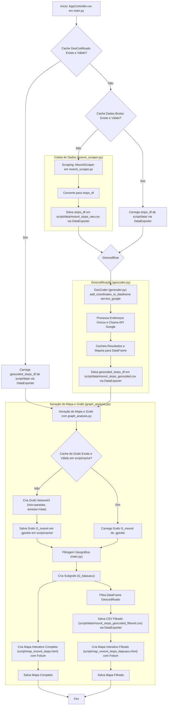

# Documentação Detalhada do Sistema de Análise de Transporte Público de Maricá

## 1. Introdução e Objetivos

Este documento descreve em detalhes a arquitetura, o funcionamento e os componentes do sistema de coleta, processamento e análise de dados de transporte público de Maricá, RJ. A principal fonte de dados é o site Moovit.

O **objetivo central** é criar uma representação digital e analítica da rede de transporte público de Maricá, permitindo:
-   Entender a estrutura das rotas de ônibus.
-   Identificar paradas e seus respectivos pontos geográficos (latitude e longitude).
-   Analisar a conectividade da rede de transporte.
-   Visualizar a rede de forma interativa em um mapa.
-   Fornecer uma base de dados para futuras análises de mobilidade urbana.

O sistema automatiza o processo de coleta de dados, geocodificação de paradas, construção de um modelo de grafo da rede e geração de um mapa interativo.
Adicionalmente, o sistema agora permite filtrar os dados e o mapa para uma sub-região específica (Itaipuaçu), com base em um delimitador geográfico (bounding box). Os dados filtrados para sub-regiões, como Itaipuaçu, também servem como base para análises mais detalhadas e específicas, como estudos de otimização de rotas e cobertura de vias principais.

## 2. Arquitetura do Sistema

O sistema é modular, composto por scripts Python especializados que trabalham em conjunto sob a orquestração de um controlador principal.

### 2.1. Orquestração Central (`main.py`)

O script `main.py` é o coração do sistema. Ele contém a classe `AppController`, responsável por:
-   Gerenciar o fluxo completo de execução, desde a coleta de dados até a geração do mapa.
-   Coordenar a interação entre os diferentes módulos (Scraper, Geocoder, DataExporter, GraphAnalysis).
-   Controlar as opções de cache, permitindo forçar a recoleta (`force_rescrape`) ou a regeocodificação (`force_regeocode`) dos dados.
-   Definir e gerenciar os caminhos para arquivos de dados, cache e saída.
-   Inicializar e configurar os componentes necessários.
-   Aplicar um filtro geográfico para gerar um conjunto de dados e mapa focados em uma sub-região específica (atualmente configurado para Itaipuaçu).

### 2.2. Módulos Especializados

-   **`moovit_scraper.py` (Coleta de Dados do Moovit)**:
    -   Este módulo, através da classe `MoovitScraper`, é encarregado de realizar o web scraping do site Moovit.
    -   Ele navega pelas páginas de linhas de ônibus de Maricá, extrai os links para cada linha e, em seguida, visita cada página de linha para coletar informações detalhadas sobre as paradas, como nome, ordem na rota e sentido.
    -   Implementa mecanismos de retry para requisições HTTP e utiliza a biblioteca `BeautifulSoup4` para parsear o conteúdo HTML.

-   **`geocoder.py` (Conversão de Endereços para Coordenadas)**:
    -   A classe `GeoCoder` neste módulo é responsável por traduzir os nomes das paradas de ônibus em coordenadas geográficas (latitude e longitude).
    -   Utiliza primariamente a API de Geocodificação do Google Maps para alta precisão, necessitando de uma chave de API (`GOOGLE_MAPS_API_KEY`).
    -   Para otimizar as buscas e respeitar os limites da API, ele geocodifica apenas os nomes de paradas únicos e armazena os resultados em um cache interno.
    -   Refina as buscas utilizando o parâmetro `components` da API do Google, especificando "Maricá", "Rio de Janeiro", "BR" para melhorar a acurácia dos resultados.

-   **`data_exporter.py` (Persistência e Gerenciamento de Dados)**:
    -   O módulo `data_exporter.py`, com sua classe `DataExporter`, lida com a gravação e leitura de dados, principalmente DataFrames do Pandas, para arquivos CSV.
    -   Garante a consistência das colunas e formatação ao salvar os dados brutos coletados (`moovit_stops_raw.csv`) e os dados enriquecidos com coordenadas (`moovit_stops_geocoded.csv`).

-   **`graph_analysis.py` (Análise de Rede e Visualização)**:
    -   Este módulo contém funções para construir, analisar e visualizar a rede de transporte como um grafo.
    -   Utiliza a biblioteca `NetworkX` para criar um grafo direcionado (`DiGraph`) onde as paradas são nós e as conexões diretas entre paradas sequenciais em uma rota são arestas. As arestas podem ter pesos, como a distância geodésica entre paradas (calculada usando `geopy`).
    -   É responsável por gerar o mapa HTML interativo (`map_moovit_stops.html`) usando a biblioteca `Folium`, plotando as paradas e as rotas. Também gera uma versão filtrada do mapa (`map_moovit_stops_itaipuacu.html`) se a filtragem geográfica estiver ativa.
    -   Implementa um sistema de cache para o grafo (`cached_moovit_graph.gpickle`), salvando e carregando o objeto do grafo para evitar recálculos demorados.

## 3. Fluxo de Execução Detalhado

O `AppController` em `main.py` gerencia o seguinte fluxo:

1.  **Inicialização**:
    -   `main.py`: Define constantes como URLs do Moovit, nomes de arquivos de dados e cache. Instancia `MoovitScraper`, `GeoCoder` e `DataExporter`.

2.  **Verificação de Cache de Dados Geocodificados**:
    -   `main.py`: Verifica se o arquivo `script/data/moovit_stops_geocoded.csv` existe e se a regeocodificação não foi forçada.
    -   Se sim, `data_exporter.py` (indiretamente através do Pandas) carrega os dados geocodificados. O fluxo pode pular para a Geração do Mapa.

3.  **Verificação de Cache de Dados Brutos**:
    -   `main.py`: Se os dados geocodificados não foram carregados, verifica a existência do arquivo `script/data/moovit_stops_raw.csv` (e se a recoleta não foi forçada).
    -   Se sim, `data_exporter.py` carrega os dados brutos.

4.  **Coleta de Dados (Scraping)**:
    -   `main.py`: Se nenhum cache de dados brutos foi encontrado ou se `force_rescrape` é `True`.
    -   `moovit_scraper.py`:
        -   Busca o conteúdo HTML da página principal de linhas do Moovit.
        -   Extrai os links de cada linha de ônibus.
        -   Para cada linha, acessa a página de detalhes e extrai informações das paradas (nome, ordem, sentido).
    -   `main.py`: Agrega todos os dados das paradas.
    -   `data_exporter.py`: Salva o DataFrame resultante em `script/data/moovit_stops_raw.csv`.

5.  **Geocodificação**:
    -   `main.py`: Se os dados brutos foram carregados (do cache ou scraping) e os dados geocodificados ainda não existem (ou `force_regeocode` é `True`).
    -   `geocoder.py`:
        -   Recebe o DataFrame com os dados brutos.
        -   Identifica nomes de parada únicos para otimizar chamadas à API.
        -   Para cada nome de parada único, chama a API de Geocodificação do Google, utilizando `components` para o contexto geográfico de Maricá.
        -   Armazena os resultados (latitude, longitude, endereço formatado) em um cache interno.
        -   Mapeia os resultados geocodificados de volta para todas as paradas no DataFrame.
    -   `data_exporter.py`: Salva o DataFrame enriquecido com coordenadas em `script/data/moovit_stops_geocoded.csv`.

6.  **Geração do Grafo e Mapa Interativo**:
    -   `main.py`: Se os dados geocodificados estão disponíveis e válidos.
    -   `graph_analysis.py`:
        -   **Cache do Grafo**: Tenta carregar um grafo pré-existente de `script/cache/cached_moovit_graph.gpickle`. A validade do cache é verificada comparando sua data de modificação com a do arquivo de dados geocodificados.
        -   **Criação do Grafo**: Se o cache do grafo não for válido ou não existir:
            -   Cria um `networkx.DiGraph`.
            -   Nós: Paradas de ônibus únicas (com atributos de latitude, longitude).
            -   Arestas: Conexões direcionadas entre paradas sequenciais em uma linha/sentido, com peso representando a distância geodésica.
            -   Salva o grafo criado no arquivo de cache `.gpickle`.
        -   **Filtragem Geográfica (Ex: Itaipuaçu)**:
            -   `main.py`: Utiliza coordenadas pré-definidas (bounding box) para identificar nós (paradas) dentro da área de interesse (ex: Itaipuaçu).
            -   Cria um subgrafo contendo apenas os nós e arestas dentro dessa área.
            -   Filtra o DataFrame de dados geocodificados para corresponder ao subgrafo.
            -   `data_exporter.py`: Salva este DataFrame filtrado em `script/data/moovit_stops_geocoded_filtered.csv`.
        -   **Geração do Mapa**:
            -   Usa `Folium` para criar um mapa base.
            -   Adiciona marcadores para cada parada de ônibus (do grafo completo ou do subgrafo).
            -   Desenha linhas (`PolyLine`) conectando as paradas conforme as arestas do grafo (completo ou subgrafo).
            -   Salva o mapa resultante como `script/map_moovit_stops.html` (mapa completo) e `script/map_moovit_stops_itaipuacu.html` (mapa filtrado).

## 4. Estrutura de Arquivos e Diretórios do Projeto

```
uerj-mat-discreta-2/
└── script/
    ├── main.py                     # Ponto de entrada e orquestrador principal (AppController)
    ├── moovit_scraper.py           # Lógica de coleta de dados do site Moovit (MoovitScraper)
    ├── geocoder.py                 # Lógica de geocodificação de endereços (GeoCoder)
    ├── data_exporter.py            # Utilitários para salvar e carregar dados (DataExporter)
    ├── graph_analysis.py           # Funções para análise de grafos e criação de mapas interativos
    ├── setup.sh                    # Script para configuração do ambiente e instalação de dependências
    ├── requirements.txt            # Lista de dependências Python do projeto
    ├── README.md                   # Esta documentação detalhada
    ├── .gitignore                  # Especifica arquivos e diretórios a serem ignorados pelo Git
    |
    ├── data/                       # Diretório para armazenar arquivos de dados CSV
    │   ├── moovit_stops_raw.csv    # Dados brutos das paradas, coletados diretamente do Moovit
    │   └── moovit_stops_geocoded.csv # Dados das paradas enriquecidos com coordenadas geográficas
    │   └── moovit_stops_geocoded_filtered.csv # Dados geocodificados, filtrados para a região de Itaipuaçu
    |
    ├── cache/                      # Diretório para armazenar dados em cache
    │   └── cached_moovit_graph.gpickle # Objeto do grafo da rede de transporte serializado
    |
    ├── tests/                      # Diretório para scripts de análises específicas e testes
    │   ├── otimizacao/             # Análise de otimização da malha de Itaipuaçu
    │   │   ├── main.py             # Script principal da análise de otimização
    │   │   ├── readme.md           # Documentação da análise de otimização
    │   │   └── map.html            # Mapa gerado pela análise de otimização
    │   └── principal-carlos-marighella/ # Análise da via principal Av. Carlos Marighella
    │       ├── main.py             # Script principal da análise da via
    │       ├── readme.md           # Documentação da análise da via
    │       └── map.html            # Mapa gerado pela análise da via
    |
    └── map_moovit_stops.html       # Saída: mapa HTML interativo da rede de transporte completa de Maricá
    └── map_moovit_stops_itaipuacu.html # Saída: mapa HTML interativo da rede filtrada para uma sub-região (ex: Itaipuaçu)
```

-   **`setup.sh`**: Este script shell auxilia na configuração inicial do ambiente. Suas principais funções são:
    -   Criar os diretórios `data/` e `cache/` caso não existam.
    -   Instalar todas as dependências Python listadas em `requirements.txt` usando `pip`.
    -   Lembrar o usuário sobre a necessidade de configurar a variável de ambiente `GOOGLE_MAPS_API_KEY`.
-   **`requirements.txt`**: Lista as bibliotecas Python necessárias para o projeto (ex: `requests`, `beautifulsoup4`, `pandas`, `networkx`, `folium`, `geopy`).
-   **`.gitignore`**: Configurado para que o Git ignore arquivos e pastas que não devem ser versionados, como o diretório `__pycache__/` gerado pelo Python.

## 5. Configuração e Execução do Sistema

### 5.1. Pré-requisitos
-   Python (versão 3.8 ou superior recomendada).
-   `pip` (gerenciador de pacotes Python).
-   Acesso à internet (para coleta de dados e geocodificação).

### 5.2. Configuração Inicial

1.  **Clone o Repositório (se aplicável)**.
2.  **Chave da API do Google Maps**:
    -   Você precisará de uma chave da API de Geocodificação do Google Maps.
    -   Esta chave deve ser configurada como uma variável de ambiente chamada `GOOGLE_MAPS_API_KEY`.
    -   Exemplo (Linux/macOS): `export GOOGLE_MAPS_API_KEY="SUA_CHAVE_API_AQUI"` (adicione ao seu `~/.bashrc` ou `~/.zshrc` para persistência).
3.  **Instalação de Dependências**:
    -   Navegue até o diretório `script/`.
    -   Execute o script de configuração: `bash setup.sh`.
    -   Alternativamente, instale manualmente: `pip install -r requirements.txt`.

### 5.3. Executando o Sistema
-   Após a configuração, execute o script principal a partir do diretório `script/`:
    ```bash
    python main.py
    ```
-   **Parâmetros de Execução (Opcionais)**:
    -   `--force-rescrape`: Força a coleta de dados do Moovit, ignorando o cache de dados brutos.
      ```bash
      python main.py --force-rescrape
      ```
    -   `--force-regeocode`: Força a geocodificação dos dados, ignorando o cache de dados geocodificados.
      ```bash
      python main.py --force-regeocode
      ```
    -   Ambos podem ser usados juntos:
      ```bash
      python main.py --force-rescrape --force-regeocode
      ```

A saída principal será o arquivo `script/map_moovit_stops.html`, que pode ser aberto em qualquer navegador web.

## 6. Fluxograma do Sistema



## 7. Aplicações e Análises Derivadas

A partir dos dados filtrados gerados pelo fluxo principal (ex: `script/data/moovit_stops_geocoded_filtered.csv` para Itaipuaçu), são conduzidas análises mais aprofundadas e focadas. Estas análises residem no diretório `script/tests/` e possuem seus próprios scripts e documentações detalhadas:

-   **Análise de Otimização da Malha de Pontos de Ônibus (Itaipuaçu)**:
    -   Localização: `script/tests/otimizacao/`
    -   Objetivo: Avaliar a rede de Itaipuaçu usando um grafo multimodal, calcular caminhos ótimos (Dijkstra, A*), e identificar pontos de maior centralidade.
    -   Detalhes: Consulte `script/tests/otimizacao/readme.md`.

-   **Análise da Cobertura da Via Principal (Av. Carlos Marighella, Itaipuaçu)**:
    -   Localização: `script/tests/principal-carlos-marighella/`
    -   Objetivo: Analisar especificamente a distribuição de pontos de ônibus ao longo da Av. Carlos Marighella, identificando gaps e sugerindo novos pontos.
    -   Detalhes: Consulte `script/tests/principal-carlos-marighella/readme.md`.

Essas análises especializadas utilizam o arquivo `moovit_stops_geocoded_filtered.csv` como sua principal entrada de dados, demonstrando como o sistema central de processamento de dados habilita estudos mais granulares.

## 8. Considerações Técnicas e Limitações

-   **Dependências Externas**:
    -   O sistema depende da estrutura e disponibilidade do site Moovit. Mudanças no layout do site podem quebrar o scraper.
    -   A geocodificação depende da API do Google Maps, que possui cotas de uso e requer uma chave válida.
-   **Gerenciamento de Erros**: Embora haja tratamento básico de erros (ex: retentativas em requisições HTTP), o sistema pode ser sensível a falhas de rede ou respostas inesperadas das APIs.
-   **Escalabilidade**: Para cidades significativamente maiores, o tempo de scraping e geocodificação pode aumentar consideravelmente. O uso de cache é crucial para mitigar isso em execuções subsequentes.
-   **Precisão da Geocodificação**: A precisão depende da qualidade dos nomes das paradas e da capacidade da API do Google de interpretá-los corretamente, mesmo com o auxílio do parâmetro `components`.

## 9. Melhorias Futuras

-   **Robustez do Scraper**: Implementar mecanismos mais avançados para lidar com alterações no site Moovit (ex: adaptadores configuráveis).
-   **Geocodificadores Alternativos**: Adicionar suporte a outros serviços de geocodificação (ex: Nominatim como fallback) para maior resiliência.
-   **Análises Avançadas de Grafo**: Incorporar mais métricas de análise de rede (centralidade, caminhos mais curtos entre quaisquer duas paradas, etc.).
-   **Interface de Usuário**: Desenvolver uma interface gráfica simples para facilitar a execução e visualização dos resultados.
-   **Testes Automatizados**: Implementar testes unitários e de integração para garantir a confiabilidade do código.
-   **Logging Detalhado**: Melhorar o sistema de logging para facilitar o debug e monitoramento. 