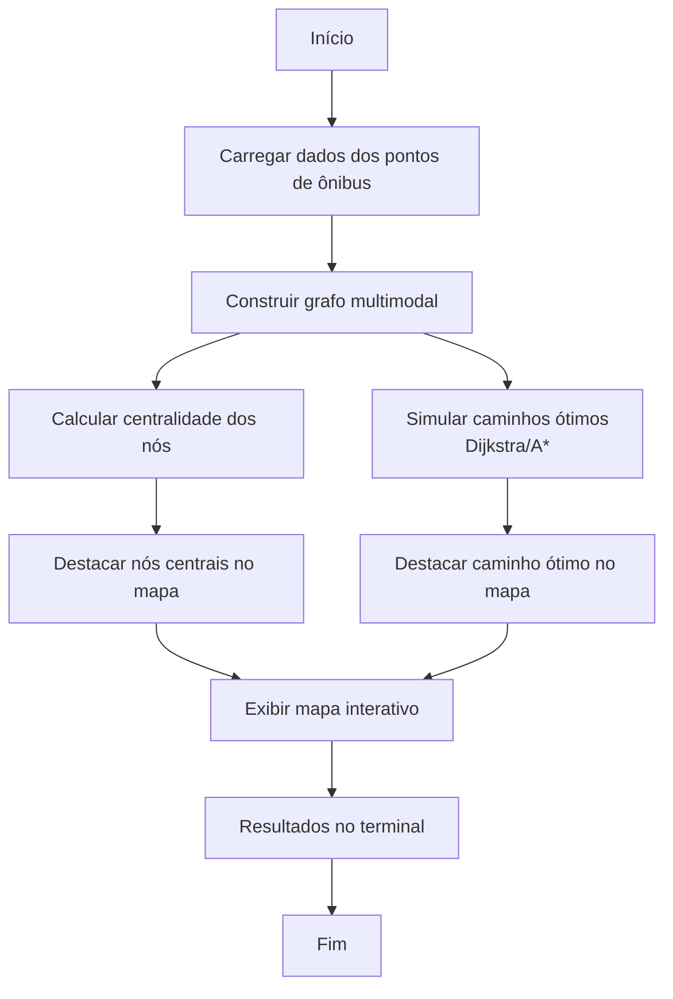

# Análise de Otimização da Malha de Pontos de Ônibus — Itaipuaçu/Maricá

## Motivação e Direcionamento do Projeto

Este projeto foi idealizado para permitir uma análise profunda e flexível da malha de pontos de ônibus de Itaipuaçu/Maricá, com foco em **otimização de trajetos, conectividade e centralidade**. Utilizamos conceitos de grafos e algoritmos de otimização para entender a rede real, identificar gargalos, pontos estratégicos e simular trajetos ótimos, considerando transferências naturais entre linhas diferentes no mesmo ponto físico.

### Estrutura Multimodal do Grafo
- **Cada nó representa um ponto físico único** (latitude, longitude), agregando todas as linhas, sentidos, ids e endereços daquele local.
- **Arestas conectam pontos consecutivos** na ordem de cada linha/sentido, mas todos compartilham o mesmo nó se estiverem na mesma coordenada.
- **Transferências entre linhas** são naturais: se várias linhas passam pelo mesmo ponto, o algoritmo pode trocar de linha nesse ponto sem necessidade de arestas extras.

### Foco da Visualização
- O objetivo é destacar **caminhos ótimos** (Dijkstra/A*), **pontos centrais** (maior grau de passagem) e a conectividade da rede.
- Não há destaque visual para distâncias entre paradas (todas as arestas são cinza), pois o foco não é cobertura ou gaps, mas sim otimização e estrutura da malha.

### Plano de Refatoração e Justificativas

- **Carregamento dos Dados**
  - O CSV é carregado integralmente, sem filtro por nome de rua, para garantir uma visão global da malha.
  - Cada parada é representada como um nó do grafo.
  - As arestas são baseadas nas conexões reais já existentes na base (ordem de parada dentro de cada linha e sentido), evitando sequências artificiais.

- **Construção do Grafo**
  - Cada parada é um nó.
  - As arestas são criadas conforme as conexões reais entre as paradas (respeitando a ordem de parada em cada linha e sentido).
  - O peso da aresta é a distância geográfica real entre as paradas conectadas.

- **Algoritmos de Caminho**
  - Implementação dos algoritmos de Dijkstra e A* para encontrar caminhos mínimos entre dois pontos (paradas).
  - O custo do caminho é a soma das distâncias das arestas percorridas.
  - Para o A*, a heurística utilizada é a distância geodésica entre os pontos.

- **Análise de Nós Visitados (Centralidade)**
  - Contabiliza quantas vezes cada nó (parada) é visitado em diferentes linhas, permitindo identificar pontos de maior centralidade ou repetição.
  - Isso é fundamental para sugerir melhorias, reforço de infraestrutura ou identificar gargalos.

- **Visualização**
  - O grafo real é exibido, com as arestas reais da base.
  - Os nós mais visitados/centrais são destacados (amarelo/lime, raio maior).
  - O caminho ótimo encontrado (Dijkstra) é destacado no mapa.
  - Todas as informações detalhadas são exibidas nos popups dos pontos.

### Próximos Passos e Decisões Tomadas
- Remoção do filtro por nome de rua.
- Estruturação do grafo realista a partir do CSV.
- Implementação dos algoritmos de Dijkstra e A*.
- Análise de centralidade dos nós.
- Ajuste da visualização para destacar os resultados das buscas e pontos estratégicos.
- Comentários explicativos em cada etapa do código para facilitar manutenção e futuras análises.

---

## Etapas da Análise

1. **Carregamento e Limpeza dos Dados**
   - Os dados são carregados do CSV, mantendo apenas pontos com informações essenciais (latitude, longitude, ordem de parada, endereço, nome e número da linha, sentido).
   - Não há filtro por nome de rua: toda a malha é considerada.

2. **Construção do Grafo Multimodal**
   - Cada nó é uma coordenada (lat, lon), agregando todas as linhas, ids, sentidos, ordens e endereços daquele local.
   - As arestas conectam pontos consecutivos na ordem de cada linha/sentido.

3. **Cálculo de Centralidade**
   - Para cada ponto, calcula-se o grau de centralidade (quantas conexões possui).
   - As 5 paradas mais centrais são destacadas no mapa (amarelo/lime, raio maior, tooltip especial).

4. **Simulação de Caminhos Ótimos (Dijkstra e A*)**
   - **Definição dos Pontos de Origem e Destino:**
     - O script agora permite que o usuário especifique coordenadas de **origem** e **destino** personalizadas para a simulação de rotas.
     - Isso é feito diretamente no arquivo `main.py`, modificando as variáveis `USER_SOURCE_COORD` e `USER_TARGET_COORD` no início do script.
       ```python
       # Exemplo de como definir no main.py:
       # USER_SOURCE_COORD = (latitude_origem, longitude_origem)
       # USER_TARGET_COORD = (latitude_destino, longitude_destino)
       USER_SOURCE_COORD = (-22.9672379, -42.9099213) # Substitua pela sua origem
       USER_TARGET_COORD = (-22.9675662, -42.9707889) # Substitua pelo seu destino
       ```
     - Se `USER_SOURCE_COORD` ou `USER_TARGET_COORD` forem deixados como `None` (o padrão inicial), o script utilizará a primeira e a última parada encontradas no arquivo CSV de dados (`moovit_stops_geocoded_filtered.csv`) como origem e destino, respectivamente.
     - O script verifica se as coordenadas fornecidas correspondem a nós existentes no grafo. Se um ponto não for encontrado, uma mensagem de erro será exibida e a execução será interrompida.
   - Os algoritmos Dijkstra e A* são aplicados entre os pontos de origem e destino definidos.
   - O caminho ótimo encontrado é impresso no terminal (lista de pontos, endereços, distância total, número de paradas).
   - O caminho ótimo de Dijkstra é destacado no mapa (linha preta grossa).

5. **Visualização Interativa**
   - O mapa mostra:
     - Todos os pontos da malha, com endereço no hover e informações completas no popup.
     - As conexões reais entre as paradas, todas em cinza neutro.
     - As paradas mais centrais em destaque (amarelo/lime, raio maior, tooltip/popup especial).
     - O caminho ótimo de Dijkstra, se existir, destacado em preto.

6. **Resultados no Terminal**
   - Caminho ótimo (Dijkstra e A*), distância total, número de paradas.
   - Paradas mais centrais (maior grau de passagem).

---

## Diagrama do Fluxo da Análise e Otimização


**Explicação dos nós:**
- **Construir grafo multimodal:** Cada nó é um ponto físico único, agregando todas as linhas e conexões reais.
- **Calcular centralidade dos nós:** Mede a importância de cada ponto na rede.
- **Simular caminhos ótimos:** Usa Dijkstra e A* para encontrar o menor caminho entre dois pontos.
- **Destacar nós centrais:** Pontos mais estratégicos aparecem em destaque no mapa.
- **Destacar caminho ótimo:** Linha preta grossa mostra o trajeto mínimo encontrado.
- **Exibir mapa interativo:** Visualização de toda a malha, conexões, destaques e popups.
- **Resultados no terminal:** Caminhos, distâncias, centralidade e diagnósticos.

---

## Como interpretar o mapa e os resultados
- **Pontos amarelos/limão grandes:** Paradas mais centrais (maior grau de passagem).
- **Linha preta grossa:** Caminho ótimo (Dijkstra) entre os pontos simulados.
- **Demais pontos:** Paradas normais, com informações detalhadas no popup.
- **Arestas cinza:** Conexões reais da malha, sem destaque para distância.
- **Terminal:** Mostra os caminhos ótimos, distâncias e as paradas mais estratégicas da rede.

---

## Exemplo de Execução e Resultados

Abaixo está um exemplo real de execução do script, mostrando a saída do terminal ao rodar a análise de otimização com o grafo multimodal. **A saída pode variar dependendo das coordenadas de origem e destino especificadas no arquivo `main.py` (sejam elas personalizadas ou o padrão da primeira/última parada do CSV).** O exemplo a seguir demonstra uma execução com coordenadas personalizadas:

```
Usando coordenadas definidas pelo usuário: Origem=(-22.9672379, -42.9099213), Destino=(-22.9675662, -42.9707889)
Caminho ótimo (Dijkstra) de (-22.9672379, -42.9099213) para (-22.9675662, -42.9707889):
  - (-22.9672379, -42.9099213) | ['R. Cento e Vinte e Dois, 12 - Centro, Maricá - RJ, 24933-135, Brazil']
  - (-22.966281, -42.91096599999999) | ['R. Cento e Vinte e Um, 28 - Centro, Maricá - RJ, 24933-140, Brazil']
  - (-22.9673518, -42.9147663) | ['R. Cento e Dezessete Lot Jd Atlantico, 30 - Centro, Maricá - RJ, 24933-165, Brazil']
  - (-22.9674115, -42.9269091) | ['R. Oitenta e Tres Lot Jd Atlantico, 21 - Centro, Maricá - RJ, 24900-970, Brazil']
  - (-22.9702967, -42.926908) | ['R. Oitenta e Tres Lot Jd Atlantico, 7 - Centro, Maricá - RJ, 24900-970, Brazil']
  - (-22.9675662, -42.9707889) | ['Rua Trinta e Seis, Jardim Atlântico Oeste, Itaipuaçu, Maricá, Região Geográfica Imediata do Rio de Janeiro, Região Metropolitana do Rio de Janeiro, Região Geográfica Intermediária do Rio de Janeiro, Rio de Janeiro, Região Sudeste, 24931-870, Brasil']
Distância total: 6633m
Número de paradas no caminho: 6
Caminho ótimo (A*) de (-22.9672379, -42.9099213) para (-22.9675662, -42.9707889):
  - (-22.9672379, -42.9099213) | ['R. Cento e Vinte e Dois, 12 - Centro, Maricá - RJ, 24933-135, Brazil']
  - (-22.966281, -42.91096599999999) | ['R. Cento e Vinte e Um, 28 - Centro, Maricá - RJ, 24933-140, Brazil']
  - (-22.9673518, -42.9147663) | ['R. Cento e Dezessete Lot Jd Atlantico, 30 - Centro, Maricá - RJ, 24933-165, Brazil']
  - (-22.9674115, -42.9269091) | ['R. Oitenta e Tres Lot Jd Atlantico, 21 - Centro, Maricá - RJ, 24900-970, Brazil']
  - (-22.9702967, -42.926908) | ['R. Oitenta e Tres Lot Jd Atlantico, 7 - Centro, Maricá - RJ, 24900-970, Brazil']
  - (-22.9675662, -42.9707889) | ['Rua Trinta e Seis, Jardim Atlântico Oeste, Itaipuaçu, Maricá, Região Geográfica Imediata do Rio de Janeiro, Região Metropolitana do Rio de Janeiro, Região Geográfica Intermediária do Rio de Janeiro, Rio de Janeiro, Região Sudeste, 24931-870, Brasil']
Distância total: 6633m
Número de paradas no caminho: 6
Paradas mais centrais (maior grau de passagem):
  - (np.float64(-22.9033137), np.float64(-42.9369153)) | ['Rodovia Amaral Peixoto, SPAR, Inoã, Maricá, Região Geográfica Imediata do Rio de Janeiro, Região Metropolitana do Rio de Janeiro, Região Geográfica Intermediária do Rio de Janeiro, Rio de Janeiro, Região Sudeste, 24944-256, Brasil'] | grau: 40
  - (np.float64(-22.9309591), np.float64(-42.9533997)) | ['Avenida Carlos Marighella, Chácaras de Inoã, Inoã, Maricá, Região Geográfica Imediata do Rio de Janeiro, Região Metropolitana do Rio de Janeiro, Região Geográfica Intermediária do Rio de Janeiro, Rio de Janeiro, Região Sudeste, 24938-880, Brasil'] | grau: 10
  - (np.float64(-22.9646842), np.float64(-42.9790724)) | ['Rua Van Lerbergue, Barroco, Itaipuaçu, Maricá, Região Geográfica Imediata do Rio de Janeiro, Região Metropolitana do Rio de Janeiro, Região Geográfica Intermediária do Rio de Janeiro, Rio de Janeiro, Região Sudeste, 24936-530, Brasil'] | grau: 9
  - (np.float64(-22.9635752), np.float64(-42.9621312)) | ['Rua Professor Cardoso de Menezes, Jardim Atlântico Oeste, Itaipuaçu, Maricá, Região Geográfica Imediata do Rio de Janeiro, Região Metropolitana do Rio de Janeiro, Região Geográfica Intermediária do Rio de Janeiro, Rio de Janeiro, Região Sudeste, 24935-410, Brasil'] | grau: 9
  - (np.float64(-22.9589425), np.float64(-42.9826691)) | ['Avenida Carlos Marighella, Barroco, Itaipuaçu, Maricá, Região Geográfica Imediata do Rio de Janeiro, Região Metropolitana do Rio de Janeiro, Região Geográfica Intermediária do Rio de Janeiro, Rio de Janeiro, Região Sudeste, 24936-130, Brasil'] | grau: 8
Mapa 'script/tests/otimizacao/map.html' gerado.
```

**Interpretação do resultado:**
- O grafo é realmente multimodal: cada nó representa um ponto físico único, agregando todas as linhas, sentidos, ids e endereços daquele local.
- Dijkstra e A* encontram caminhos com transferências naturais entre linhas diferentes no mesmo ponto físico, se houver conexão, **baseado nos pontos de origem e destino configurados**.
- O terminal mostra o caminho ótimo encontrado, a distância total, o número de paradas e as paradas mais centrais (com maior grau de passagem).
- O mapa exibe todos os pontos, conexões reais (em cinza), destaques de centralidade e o caminho ótimo, com popups mostrando todas as informações agregadas de cada ponto.

**Importante:**
- Os algoritmos de Dijkstra e A* **só encontram caminhos se houver conexão real entre as paradas no grafo**. Ou seja, se não houver uma sequência de conexões (arestas) ligando os pontos de origem e destino, não será possível calcular o caminho mínimo.
- O grafo é construído de forma **multimodal**: cada nó representa um ponto físico único (coordenada geográfica) e agrega todas as linhas de ônibus que passam por ali. Isso significa que **transferências entre linhas diferentes que param no mesmo ponto físico são naturalmente consideradas pelos algoritmos de busca de caminho**, pois eles operam sobre esses nós unificados. Não há necessidade de criar arestas de transferência explícitas entre linhas no mesmo local, pois a troca ocorre ao se mover através do nó que representa aquela coordenada geográfica compartilhada.