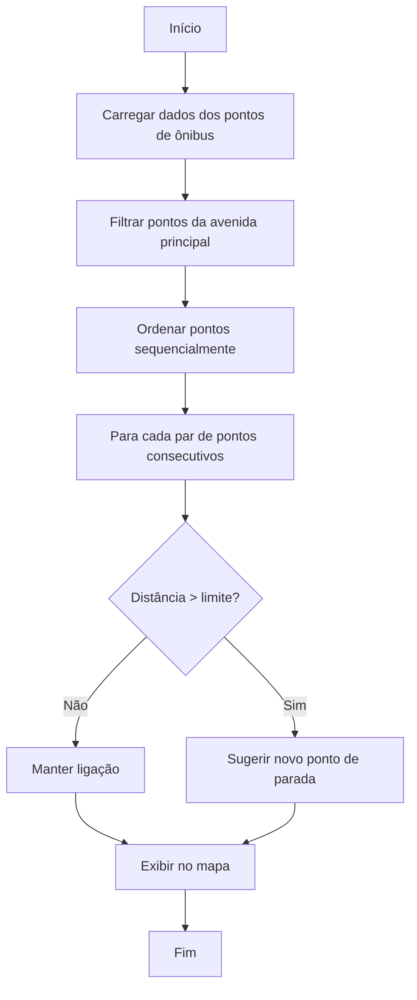

# Análise de Pontos de Ônibus — Carlos Mariguella (Itaipuaçu)

## Objetivo da Análise
Este projeto tem como objetivo analisar a distribuição e cobertura dos pontos de ônibus ao longo da principal via de Itaipuaçu, Maricá-RJ: **Avenida Carlos Mariguella**. O foco é identificar possíveis lacunas (gaps) na cobertura, sugerir novos pontos e fornecer uma visualização clara e fiel ao traçado real da rua.

---

## Sobre a Rua Principal e Nomes Considerados
- **Rua principal analisada:** Avenida Carlos Mariguella (atual grafia oficial).
- **Nomes alternativos considerados:**
  - "Carlos Marighella" (variação comum de grafia)
  - "Vitória Régia" (nome antigo da avenida, ainda presente em alguns endereços e registros)
- **Motivação:**
  - Muitos pontos de ônibus ainda estão cadastrados com o nome antigo ou com grafias inconsistentes. Para garantir uma análise completa e fiel à realidade, todos esses nomes foram considerados como "fallback" no filtro, evitando a exclusão de pontos relevantes.

---

## Etapas da Análise

1. **Carregamento e Limpeza dos Dados**
   - Os dados são carregados do arquivo `moovit_stops_geocoded_filtered.csv`.
   - Apenas pontos com informações essenciais (latitude, longitude, ordem de parada, endereço, nome e número da linha, sentido) são mantidos.

2. **Filtragem dos Pontos por Via**
   - O filtro busca todos os pontos cujo endereço contenha qualquer uma das variações de nome da avenida.
   - Isso garante que pontos com nomes antigos ou grafias alternativas não sejam descartados.

3. **Agrupamento de Pontos por Coordenada**
   - Pontos com as mesmas coordenadas são agrupados, consolidando todas as linhas que passam por aquele local.
   - O popup de cada ponto mostra todas as linhas (número e nome) que atendem aquele ponto, além de outros dados relevantes.

4. **Ordenação dos Pontos**
   - Para estabelecer uma sequência lógica ao longo da via, os pontos (agrupados por coordenada geográfica única) são preparados para a construção de um caminho linear.
   - Inicialmente, se a informação de `stop_order` (ordem da parada na linha) estiver consistentemente disponível e associada às coordenadas, ela é usada para influenciar a ordem primária dos pontos a serem considerados.
   - Em seguida, um algoritmo de "vizinho mais próximo" constrói o caminho linear final: começando por um ponto inicial (potencialmente o primeiro da lista influenciada pelo `stop_order`), ele iterativamente conecta a parada não visitada mais próxima geograficamente.
   - Esse processo garante que o traçado no mapa siga o fluxo da rua de forma sequencial, mesmo em trechos onde a `stop_order` possa ser ambígua, inconsistente entre diferentes linhas no mesmo ponto físico, ou totalmente ausente.

5. **Construção do Diagrama Linear da Rua**
   - As arestas (linhas) são desenhadas apenas entre pontos sequenciais, formando um grafo linear (sem bifurcações ou cruzamentos).
   - Cada aresta é colorida conforme a distância entre os pontos, facilitando a identificação visual de trechos com cobertura ruim.

6. **Cálculo e Sinalização de Gaps**
   - As distâncias entre pontos sequenciais são calculadas.
   - Se a distância entre dois pontos exceder 450 metros, é sugerido um novo ponto intermediário, sinalizado no mapa.

7. **Visualização Interativa**
   - O mapa gerado mostra:
     - Todos os pontos de ônibus da avenida, com endereço no hover e informações completas no popup.
     - As conexões sequenciais coloridas por distância.
     - Sugestões de novos pontos onde há gaps grandes.

---

## Diagrama do Fluxo da Análise (Mermaid)

**Explicação dos nós:**
- **Filtrar pontos da avenida principal:** Considera todas as variações de nome (ex: Carlos Mariguella, Carlos Marighella, Vitória Régia).
- **Ordenar pontos sequencialmente:** Usa ordem de parada e proximidade geográfica.
- **Para cada par de pontos consecutivos:** Analisa a distância entre eles.
- **Distância > limite?:** Se a distância for maior que o limite definido, sugere um novo ponto.
- **Exibir no mapa:** Mostra todos os pontos, ligações e sugestões de novos pontos.

---